# The OpenForge 2.0 system

## What is OpenForge

OpenForge is a modular gaming terrain system with sets ranging across various themes, these include, dungeons, caverns, towns, scatter terrain, minis, and more. Perfect for your Table Top Role Playing Games (TTRPG) needs. Some example games include, Dungeons & Dragons (D&D), Pathfinder, wargaming, WarHammer, and more. OpenForge 2.0 is designed to be compatible with 28mm miniatures.

## How OpenForge Tiles work

OpenForge is based in both modularity, and flexibility. In contrast to some other tile creators/manufactures, which produce single piece tiles, OpenForge allows you to customize your tiles to fit your needs. Would you like some wooden floors with a stone wall, using any of the clip or connection systems supported, no problem, just print the desired pieces, glue them together with some CA (Cyanoacrylate) or 'super' glue, and you are good to go. Want to create even more immersive tiles, paint them in the style that fits your needs.
Most of the floors, walls, and connection systems, even from different sets (Dungeon, Cavern, Town, Etc), can be combined together, to make the perfect tiles for your needs.

### OpenForge licensing

OpenForge is open source under the creative commons license. Many of the OpenForge models are available under [CC-BY-SA](https://creativecommons.org/licenses/by-sa/4.0/), with newer premium designs released under [CC-BY-SA-NC](https://creativecommons.org/licenses/by-nc-sa/4.0/). For the exact details of the license please see [OpenForge Licensing](https://github.com/devonjones/openforge-tutorials/blob/master/How%20Do%20OpenForge%20Licenses%20Work.pdf). Lets break the license down, the CC stands for Creative commons, the type of license. The BY means you have to give attribution to the original work. The SA means share alike, you must release any derived work under the same license as the original work. The NC means non-commercial, you cannot sell the work.
So, for any work released under the CC-BY-SA-NC license you are not only free to modify them, you can distribute the awesome things you make as long as you release them under the same license. And for any work released under the CC-BY-SA license you are even allowed to sell your creations.

Should you wish to sell your creations (prints or derived work), or release them under a different license, a different license might be needed than the one the models were released under.
Any person subscribed on the merchant tier on [patreon](https://www.patreon.com/c/masterworktools/membership), can use most of the tiles under the CC-BY license, which means you can ignore the Share Alike and Non Commercial clauses of the license, in other words, you can sell prints from NC licensed models, and you can incorporate any design into your own that you can cover with any license you want so long as you still attribute the project.

There are a small number of exceptions to this (< 10).  100% of those exceptions are models released prior to 2018 that we don't have the right to relicense because either they were contributed by others, or they remix in someone else's CC-BY-SA-NC design.

## How to get OpenForge tiles?

The entire OpenForge collection with all the models can be found in three locations:

* A USB that can be bought from the official online store, [Masterwork Tools](https://masterwork-tools.com/shop). It contains all models released until 12/2024 and is $35 for about 1,400 unique designs (and ~12,000 stl files, almost 128 gigs). The USB stick will be updated at the end of each year.
* [The OpenForge catalog](https://staging.openforge.tools/), It's a website which contains all releases, catagorised and tagged making search and finding what you are looking for very easy. A detailed explanation can be found [further down](#the-openforge-catalog)
* The [Dropbox](https://www.patreon.com/posts/openforge-32812777) which is something which all paid supporters get access to. OpenForge has a [Patreon](https://www.patreon.com/masterworktools) which contains the details on how to access the Dropbox.

Furthermore, all designs remain available on [Patreon](https://www.patreon.com/masterworktools), [Thingiverse](https://www.thingiverse.com/devonjones/designs) and [MyMiniFactory](https://www.myminifactory.com/users/devonjones), but this is a nice convenience if you don’t want to spend all that time downloading files. Not every file is in each of these places (well, except the USB stick, the catalog, and the dropbox). Currently all releases will be made available through patreon, open for anyone not just paid supporters. Devon also shares the blender files which are used to design the OpenForge models. Although to get access to the blender files, you will have to ask Devon nicely, but won't worry, he is friendly and does not bite. The Dropbox and Catalog are updated with every release and should contain the entire collection in a single location, including the files released in the current year not yet available on the USB.

### The OpenForge Catalog

In the darg ages, if you wanted to build something, you had to dig trough various places to hopefully find what you were looking for. Then the dropbox came to life, and you only had to search in one location, however this did not solve all problems. The biggest problem which remained what knowing where to begin looking. If you know what you wanted but not what it could be called or located finding pieces was difficult. A problem amplified the less experienced you were with OpenForge. To try and make discovering new tiles and finding the ones you are looking for easier, a new project is underway. The OpenForge catalog. A project intended to make tile discovery intuitive, and everything in OpenForge searchable. You will be able to search by various methods, e.g. connection type, walls, floors, dungeons stone, many more, and/or any combination thereof. The OpenForge catalog is currently hosted on a website, which can be found [here](https://staging.openforge.tools/) and is currently in alpha, which means that not all features are implemented and mistakes (bugs, for those familiar with the lingo) can be present, and if you discover one, you can report it [here](https://github.com/devonjones/openforge_catalog/issues). That being said, you can already start using it for looking up tiles from certain textures, e.g. dungeon stone and cut-stone, and others to be added soon. Perhaps more are already added by the time you are reading this. The catalog supports filtering the files based on tags, indicating certain properties of the models. For example, you can filter on all walls tiles using the OpenForge connection system, which support a secret door. A future feature which is currently being developed are called "blueprints". OpenForge tiles can consist of just 1 model, but more often then not, they consist of multiple models, more details on how this works further down. Finding which pieces go together can also be time consuming or difficult, the catalog will allow you to "build" your own tile. First you select a part from a multi part model, and then the catalog will show you all compatible parts, which you can pick from. Once the entire tile is assembled the tile(s) can be downloaded all at once. No more hunting for each individual part. Just a few examples of what is planned for the catalog. Much more is planned, but lets not give away all the secrets. If you have coding skills and willing to help out, the project is open source, just reach out to Devon on discord.

## OpenForge 2.0 sets

With OpenForge being a modular terrain tile system, having a single theme just does not cut it, as there are many locations in which your game can take place. A dungeon (  [Dungeon stone](https://staging.openforge.tools/?tag=texture%7Cdungeon_stone), [Cut stone](https://staging.openforge.tools/?tag=texture%7Ccut-stone), [Rough stone](https://staging.openforge.tools/?tag=texture%7Crough_stone)), [City streets](https://staging.openforge.tools/?tag=texture%7Cstreets), [Sewer](https://staging.openforge.tools/?tag=texture%7Csewer), [Towne](https://staging.openforge.tools/?tag=texture%7Ctowne), [Caves](https://staging.openforge.tools/?tag=texture%7Ccave), [Dwarven halls](https://staging.openforge.tools/?tag=texture%7Cdwarven_halls), [Mines](https://staging.openforge.tools/?tag=texture%7Cmine), [Volcanos](https://staging.openforge.tools/?tag=texture%7Ccavern%7Cvolcanic), and so many more. Besides the larger themed sets, various other smaller categories exist, such as, scatter terrain, miniatures, encounters. The development of the various sets is partially community driven, with Patreon members being able to vote on the development roadmap, the [vote tally](https://docs.google.com/spreadsheets/d/1pq_3NUdwnaPUl4y6qhgjCeNMWWWCSBS8Vjr9oWl6qLE/edit?usp=sharing) is available for anyone to view. And some artistic freedom for whatever inspires Devon. As such, some more popular sets have more varied pieces available than others. This of course does not mean that the less popular sets should be overlooked as they are still amazing in their own right. How many adventures do you play in a volcano compared to a dungeon. The links above are just to give some examples of the sets out there. Please take a look at all the [other amazing OpenForge 2.0 creations](https://www.thingiverse.com/search?q=openforge+2.0&page=1) Devon and the community have created over the years. Please make sure that "OpenForge 2.0" is in the title, so you have the 2.0 version. Found a set you want to build? Great! Continue reading to discover how to decode the different naming conventions, learn what the different pieces are used for, and how to assemble OpenForge tiles, or skip ahead we can't stop you.

## How to assemble OpenForge tiles

Before we continue, let's take a small detour and explain how OpenForge tiles are assembled. Understanding this, will make explaining and understanding all the various tile pieces a lot easier as you can imagine how they will be used.
As already indicated before, OpenForge tiles are not single piece, but require some assembly. Most tiles consist of 2-3 pieces, with more customizable tiles requiring more. An example of the pieces required for a floor tile are, a base part, and a floor part:
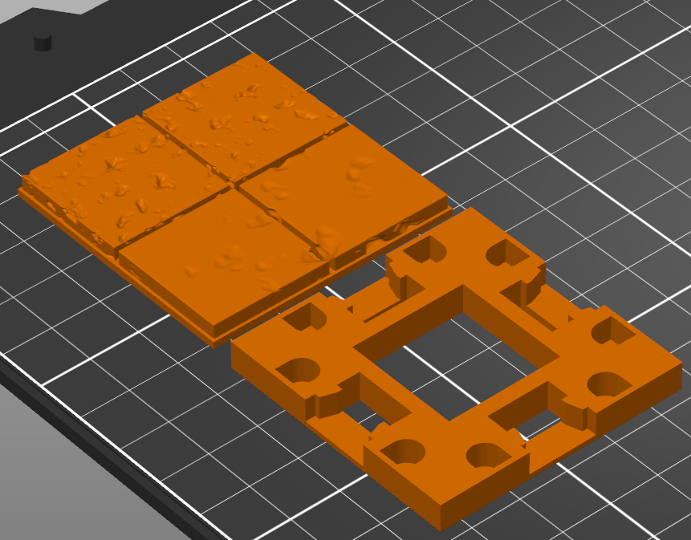

Once assembled (and painted) the tile will look something like this:
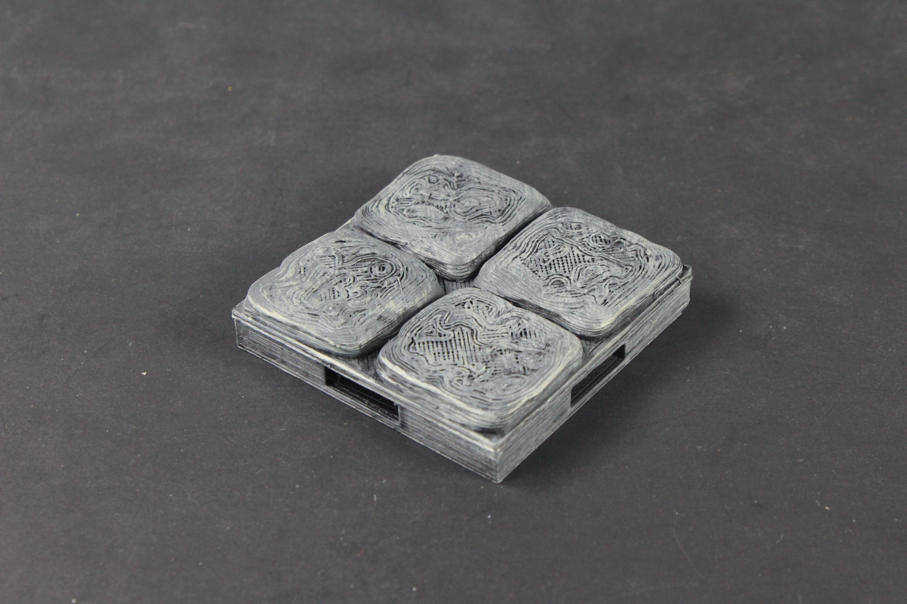

An example of the pieces required for a floor with wall tile are, a base part, a floor part, and a wall part:
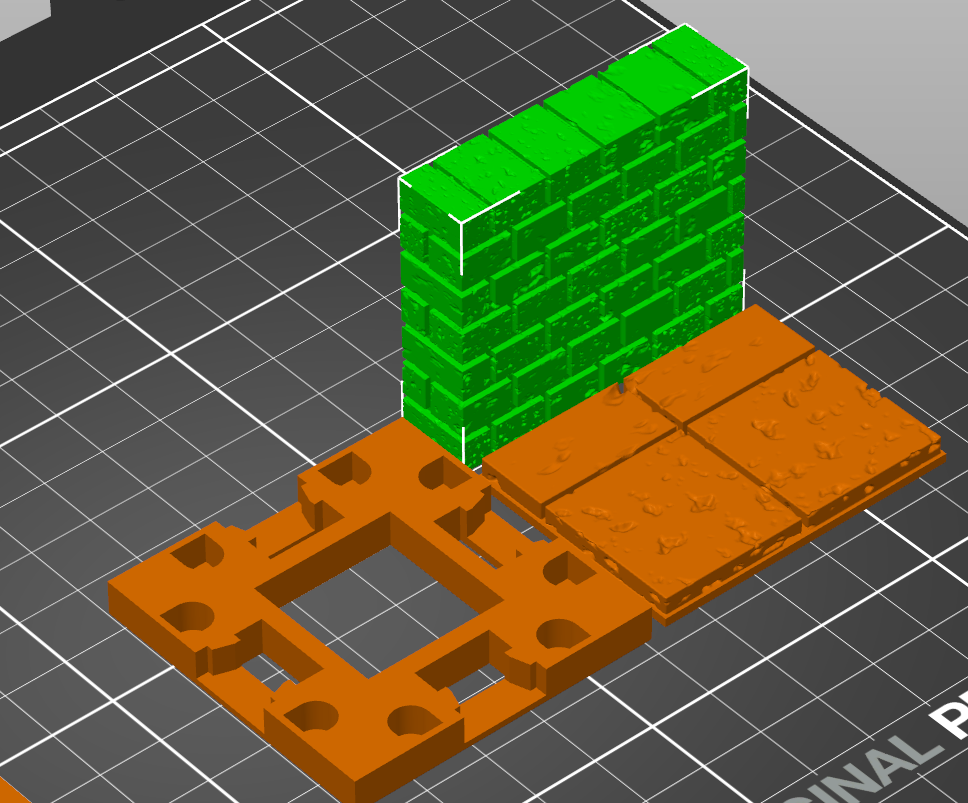
Once assembled (and painted) the tile will look something like this:
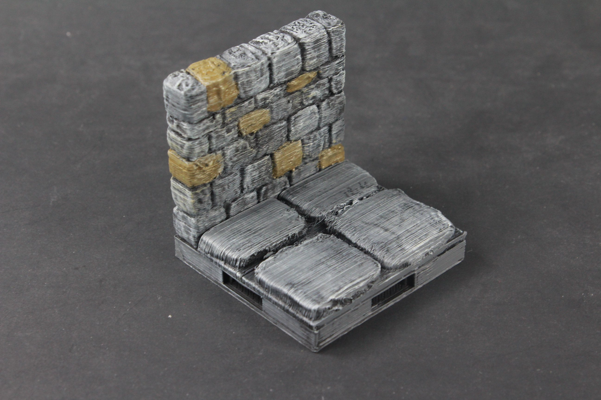

And if you get a few of them, you can start to make your own rooms:
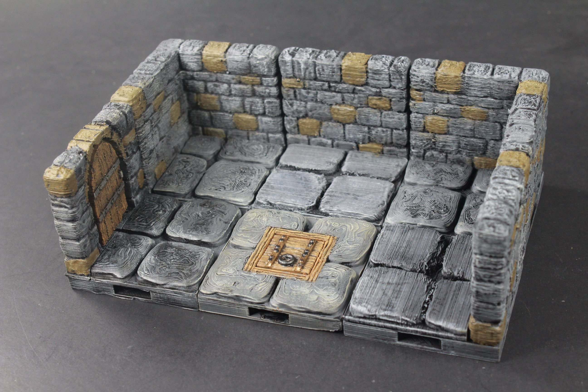

Wait! What's that? A trap door? Ow Shiny things! Expect more and shinier things the further we go, there are A LOT of variations on the basic wall and floor tiles. Wondering what a "floor" tile or "floor with wall" tile is, the name sort of already gives it way, but if you are unsure, this will be explain later. And not only those two types, but many more, there are curved tiles, stairs, traps, water tiles, and even with LED lights, and that is only scratching the surface. Also don't worry about all the "strange" shapes in the base tile, these are for the various connection systems supported by OpenForge. More on those later!

## What are all the different pieces?

So you have chosen an OpenForge set you would like to print. You know you need to assemble them, and are ready to start, just to be greeted with many, many, tiles in various shapes and sizes, serving various purposes, named in a cryptic code. Don't worry, all will be explained here. After reading this, you should be able to decode the tile names, know what purpose the  various pieces serve, and be able to find the one you need.

Lets start with the basics, the naming convention. It might not be intuitive, but that's why we're here.

### OpenForge naming convention

Note: curly brackets are not used on the file name format itself, they are used here to indicate a section.

#### Top Level

You can expect the following format when it comes to file names:
{texture}#{shape}.{size}.{connections}.stl

##### Section modifiers

Sometimes, a single word is not detailed enough, and more words and/or modifiers are needed.
The `%` is used, when multiple textures apply to a single tile.
The `+` is used to extend a shape, or connection system.
The `,` is used to add even more details when applicable.

#### Texture

Texture can be broken up into {wall texture}%{floor texture}.  If a wall texture has only one default floor texture, the floor texture is omitted.

Examples: `cut-stone` or `dungeon_stone%block`

#### Shape

Shape has a basic structure of {texture}+{options}

Both texture and options can have more than one element which is comma separated.  Items in these lists go from more general to more specific.  The +{options} section is optional.

Examples: `wall` or `door,arched+wide`

#### Size

Size comes in the form of {size}+{options}.  Sizes tend to come in two forms combinations of letters, or numbers in {X}x{Y}, {X}x, x{Y} format.  If it's numbers, {X}x{Y} indicates that the object is X by Y in inches.  Sometimes one of these will have a decimal as in 2x0.5.  Period is also used as the separator with the next area, connection options, so this is only ever the case with numbers, and connection options will never start with a number.  {X}x indicates that said object is X inches long.  x{Y} (fairly rare) indicates that the object is Y inches wide.

The +{options} section is optional, and contains a comma separated list of options to the size.

Examples: `E` or `2x` or `4x2`

For letters, OpenForge uses the [Printable Scenery OpenLOCK tesselation naming convention](https://www.thingiverse.com/thing:1833963/comments).
A small sample:
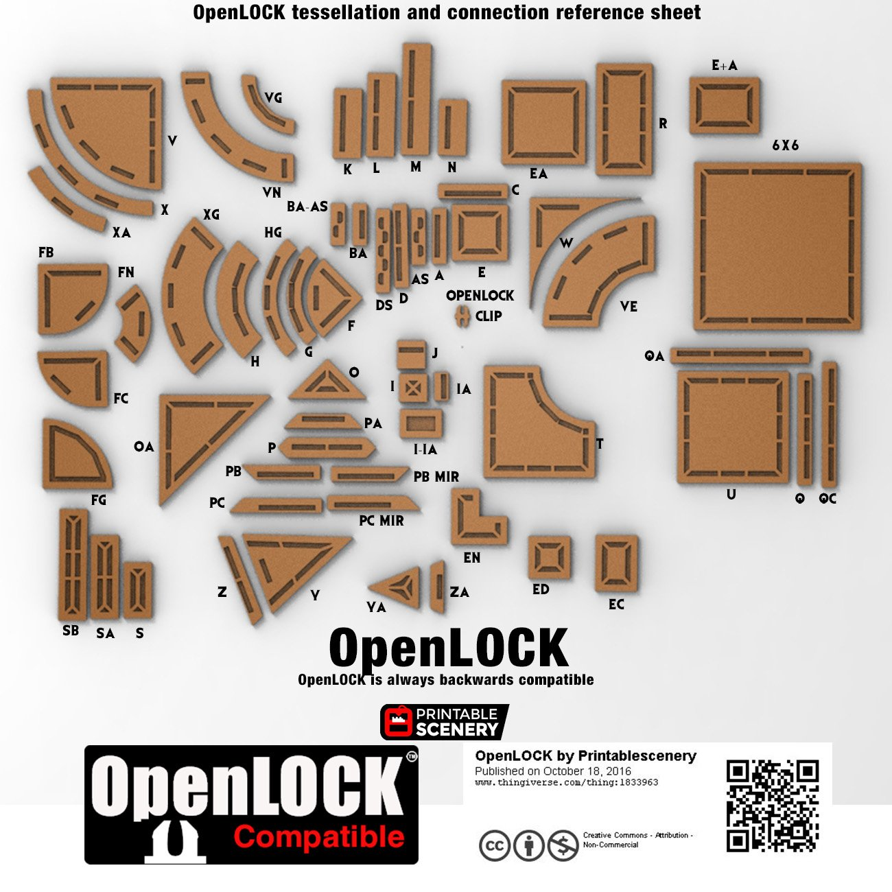

#### Connections

This section contains connection systems, and it's format is {connection}+{options}.  Both portions can be comma separated, and are aimed at being from more general to more specific.  +{options} is optional.

Examples: `openforge` or `openlock+side` or `openforge+side,dragonlock`

#### Other Files

There are other files in the hierarchy that are not tiles.  The names can be more haphazard, but in general I try to have them follow the File Name Standard as much as they can, but in many cases they will wholly skip some sections.

Examples:

`wood#door_lintel+c`

`portcullis+wide,split,a`

### Supported connection systems

Throughout the years many tile manufactures came to the scene, many with their own connection system. A few are Fat Dragon Games with DragonLock, Printable Scenery with OpenLock, and DungeonWorks With InfinityLock. These different connection systems have been integrated into the OpenForge ecosystem. Some due to the manufacturer reaching out, and others due to the community asking for it. This means that if you already have some tiles using one of the supported connection systems you can print OpenForge tiles and connect them to your existing tiles. In addition, there are conversion clips available with a different connector at each end which can be used to connect two tiles with different connections.

As of right now, OpenForge 2.0 supports the following connection systems:

* DragonLock
* OpenLock
* Magnetic

Some of these connection systems have variations, and magnetic can be combined with the other clip based connection systems.

The list of variations and combinations are:

* dragonLock
* dragonLock,magnetic+flex
* magnetic+flex
* openLock
* openLock,magnetic+flex
* openLock+topless
* openLock,magnetic+topless,flex

There have been several revisions of the magnetic connection system, with support for different types of magnets, cylindrical or spherical, and separate bases for each. Eventually a base was designed which is compatible with both magnet shapes. These bases are called "flex" bases. These flex bases are now the standard and the older bases which only support a single magnet type are not deprecated. If you find one in the wild, please look for the flex variant.

The topless bases have no overhangs, and therefore, no supports, which in turn means no sagging and less work after you print to get the tile ready.

Currently the default connection system is topless OpenLock flex bases.

#### Update to the OpenLock bases

A new supportless version of the OpenLock bases has been released, they are called supportless, and is intended to superseed the old OpenLock tiles with supports. With older 3d printer not being as good as the ones we have today, some were even made out of wood, supports were needed to ensure that the overhangs on these bases were usable. A sort of kinds supportless version was already available, but this version (topless) simply removed the overhangs from the tile, no overhangs, no supports needed. However with newer printer being way more capable and having better bridging, these overhangs can now be printed without supports. If you have a modern printer consider trying out these supportless tiles, 

#### Magnets, how do they work?

During most of OpenForge 2.0 existence, the main option for magnetic connection was the 5mm spherical magnets. However, during the pandemic, they became difficult or near impossible to get ahold of. In addition, several countries have since banned the sale of these types of magnets. Some children would eat the magnets which could require surgery to remove.
As such, a new base was designed, now with support for cylindrical and spherical magnets, the so called [flex magnetic](https://www.myminifactory.com/object/3d-print-openforge-wall-on-tile-bases-and-risers-192663) bases.

The flex magnetic bases in additional to supporting 5mm spheres, they are also support variety of cylindrical magnets including:

* [5mm diameter, 3mm thick](https://amzn.to/3TiebAV)
* [5mm diameter, 2mm thick](https://amzn.to/3n2prFa)
* [4mm diameter, 3mm thick](https://amzn.to/3JOtXzd)
* [4mm diameter, 2mm thick](https://amzn.to/3looXJl)
* [3/16" diameter, 1/8" thick](https://www.kjmagnetics.com/proddetail.asp?prod=D32AH&gclid=CjwKCAjw5dqgBhBNEiwA7PryaIFfjrjwztjEo_E-M-RiKUUqM3fHcL83LS3cIRhHASss8Dq_nckOUBoCqQcQAvD_BwE)

The design of the flex magnetic bases allows these to still spin in place, so you don't have to worry about polarity.

#### So clips?

OpenForge  2.0 supports a variety of clips. Each works slightly differently, but they all need to flex when putting them in and taking them out. Therefore, we advice to print the clips in PETG. PLA is rigid and brittle, which means the clips cannot flex much without breaking and are harder to put in and take out. PETG has much more flex and is also stronger, so perfect for clips. The next question you might ask is: "should I print my bases in PETG as well? You know, more flex more better?" The short answer is no. The longer answer is still no, but now with explanation, PETG is harder to glue and harder to paint. Keep the clips PETG and that will give you enough flex.

### Different tile types

As you might have already seen above, there is a "separate wall", and a "wall on tile" tile, besides those two types, there are a few more, so lets discuss what is up with that. The entire discussion will boil down to "where is my wall compared to the floor". Unfortunately a more complex topic that any of us in the hobby would like. And to be honest, none of the various systems are perfect, each have their strengths and weaknesses. We will discuss each of them in more detail in their own section. Which one is "best" is mostly a preference thing, but can also be situational. When you have control over the terrain layout, you can design the layout to workaround the weaknesses of the chosen system. However, when the maps are pre-made, e.g. when using a pre-made adventure, you either have to change the layout to fit the system, or combine multiple systems to remain as faithful to the original as possible. And more often than not, even when using multiple systems, (small) alterations might still be needed.

Most Table Top Role Playing Games (TTRPG) use a 1-inch grid for their maps. As such, most terrain is designed to work with the 1-inch grid, OpenForge included. The most common tile size is the 2x2 inch tile, but other sizes are used too. To ensure the 1-inch grid remains intact, tiles are often whole number multiples, e.g. no 0.5 inch tiles, but this is not always the case as we will see with Separate Wall style tiles.

#### Example Map

To illustrate the differences between the different systems we will use an example map designed to showcase the strengths and weaknesses of the various systems. The map consists of four areas, a hallway A, and three rooms B,C, and, D. Please be aware that when recreating the map with the various systems, we will limit ourselves to only using tiles from that system. A better alternative might be available in another system, but that defeats the point. We want to show where a system shines and where it falls short. If you notice such an improvement, bonus points for you! We, however, do not have a bonus shop, Sorry! But you can use the idea when making your own terrain!
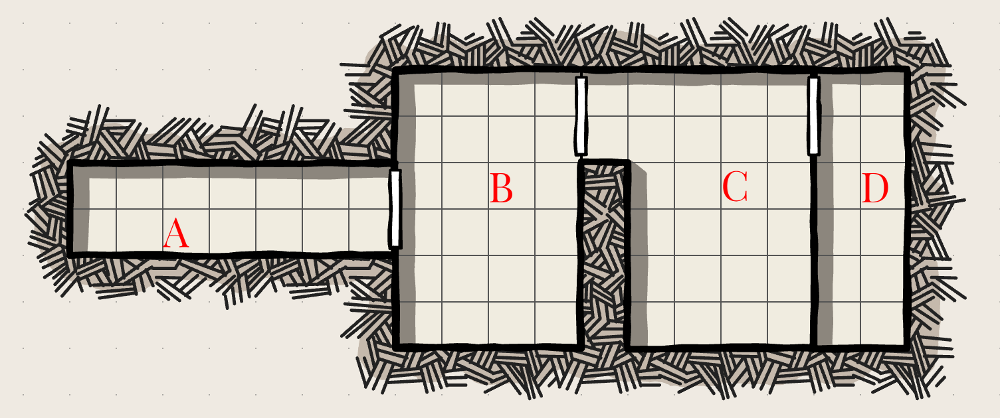

#### Separate wall (SW)

With SW, the walls and the floor pieces are separate pieces and are attached to their own bases. To create rooms, you combine the separate wall and floor pieces. This means the entire floor tile can be used for minis. However as the walls are now separate, and we do not possess shadow magic, they do take up space outside of the floor tiles. A blessing and a curse. The space taken up by the walls has to be taken into account when creating the layout of your terrain. The walls are 0.5 inches, and floor tiles are on a 1 inch grid. So having walls in between rooms will mess up the 1 inch grid. You can (or have to) compensate for the offset created by the walls, but this can result in a lot of bloat (creating extra spaces) in your terrain. A phenomenon Mr. Turtle likes to call "offset hell". One not often considered drawback of SW, are the connections. The walls are relatively narrow, and depending on which connection system you use, magnets, clips, or both, and base variant you use tiles can only be connected to one side of the wall. There are solutions to the problem, for example, there are bases which have clip connections offset from each other allowing you to connect to them from both sides. Or bases which support a "through" connection, where a special extra long clip is used to connect the two floor tiles on either side to each other with the wall in between. How to connect tiles to each other is a topic deserving of its own section.

They say a picture is worth a thousand words, so lets up the word count of the wiki by looking at an example. The example includes three 2x2 floor tiles, and walls on the back two sides. If we put them on all 4 sides it would be difficult to see the floor. The gird is 1 inch, as each floor tiles is 2 inches wide in each direction. In addition, perhaps a bit more difficult to see, each wall is half a grid square deep, so 0.5 inch. Each space on the floor tiles is a full inch, unlike with some other systems, so every floor space can be used for minis.
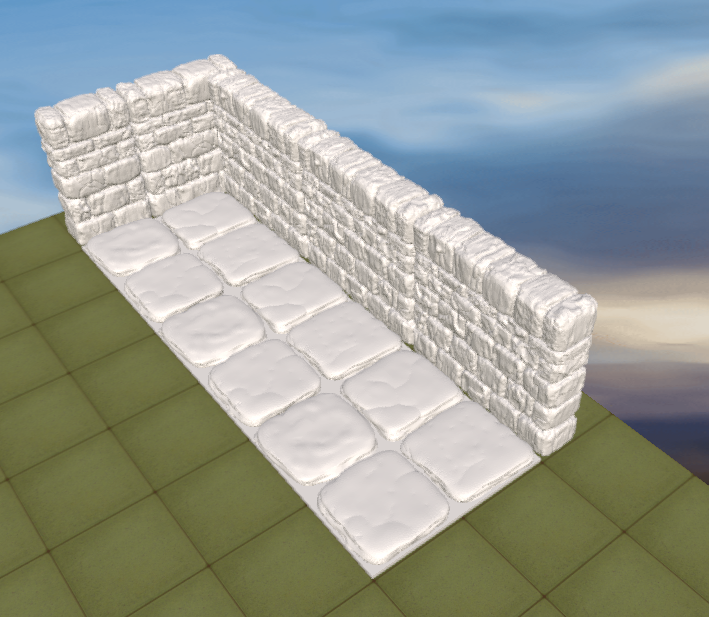

##### Example map Separate Wall

Before we begin, a challenge for the experts, please check if the map is correct with regards to the connection systems, e.g. bases with magnets, bases with clips, and bases with both. How would you connect the rooms together? You might notice that the top of the map contains gaps, while the bottom does not. The top approach is easier, while the bottom might look better. What you prefer, is up to you but now you know. let's discuss the map. The strength of the system is that all tiles in the example map are also full tiles in this map, in other words every tile is playable. There are three drawbacks, fist, the map is larger then the original. Take for example hallway A, in the example it takes up 2 spaces, in contrast to this map, where it will take up 3 spaces on the table, as each wall takes 0.5 inches of space. The same goes for all the other walls, they increase the total footprint of the map. The other drawback is that between room C and D, there is now a wall, which takes up 0.5 inches of space, so the rooms are physically further apart from each other. In our example this might not seem like a big deal, but this added distance has implications on other room and areas of a bigger map. The third drawback, the special consideration has to be given on how to connect the various rooms and hallway to each other. You might need to compromise and use special clips, or bases to achieve these connections. Or not connect them at all and just place the individual rooms next to each other.

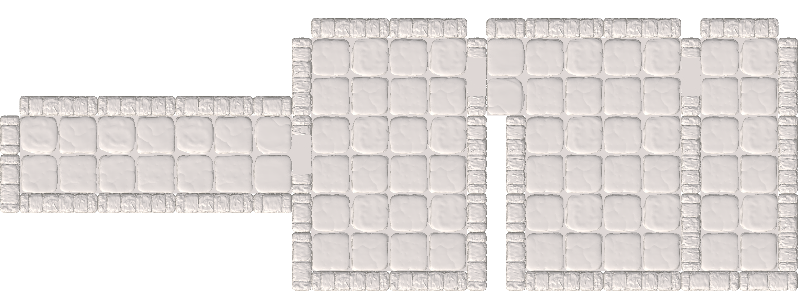

#### Wall on Tile (WoT)

This style of tile is the more common approach outside OpenForge with various other terrain system using it, e.g. Dwarven Forge, Fat Dragon Games, and more. With WoT, both the floor and the wall(s) share the same base piece. And will create a single tile once assembled. There is also a method for creating modular WoT tiles, where the floor and wall can be separated, if needed, but we will discuss this when discussing S2W. You will loose a bit of floor space where the walls are, not all (grid) spaces on the tiles are a full inch, which means less room for your minis, this is the main disadvantage of this style tile. But the main advantage, is that the tile is self contained. There are no separate wall pieces needed to create walls, doors, etc. There are also different shapes than then 2x2 inch tile, but their dimensions are whole number multiple of the 1 inch. A fancy way of saying, no fractional stuff. Therefore, all tiles follow the 1 inch grid, so you don't need additional space in between floor tiles to accommodate the walls.

The same setup as with SW is visualized with WoT. Three floor tiles, and walls on the back side. In contrast with SW, only 3 out of the 8 floor spaces are full grid squares. Most of them have been reduced in size to accommodate  the walls. One of them is even a quarter of the normal size. These smaller grid spaces cannot really be used for minis without spilling over into neighboring squares. But this more cramped setup does have a major benefit, the entire 2x2 tile fits into a 2x2 space.
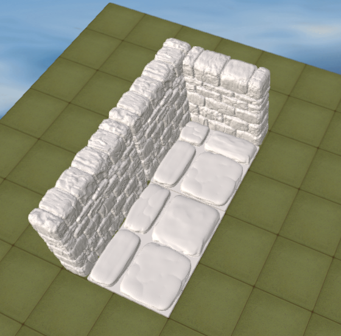

##### Example map Wall on Tile

Lets take a look at the example map when build with the WoT system. Lets start with hallway A. In the drawing, the hallway was two tiles wide, however now it is only one tile wide. The reason for this is that the walls share the same footprint as the floors, therefore, we lose half of the floor space to walls. A similar story can be seen with room B and C, along the walls a lot of partial grid spaces are visible, not enough to space a mini on. Only about 33% of the spaces on the example map are full grid spaces. The main drawback of the system. Rooms C and D are next to each other without any additional (filler) space between them. In addition, the footprint of the map is exactly the same as the example map, as the tiles are self contained. Both strengths of the system.
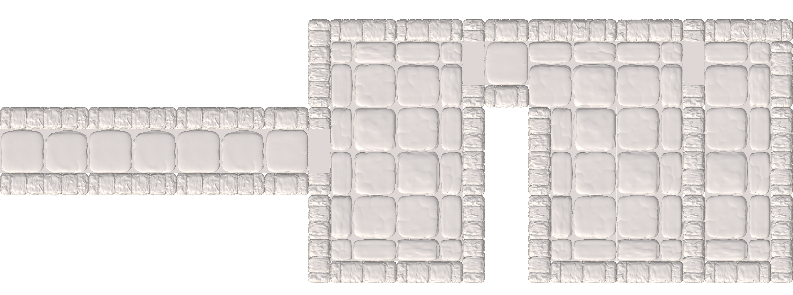

#### Separate Wall to Wall On Tile (S2W)

Let us speed run the "why, what, and how" of the S2W system. A quite genius system once you get the hang of it. The S2W system is a successor of the old WoT system. They both create self contained WoT style tiles, but the S2W system has some additional benefits  over the old WoT system.

 You either have the option of glueing the wall to the same base piece as the floor, fixating them together but having them self contained, or glueing the wall to a separate base piece and having them detachable but not self contained, but not both modular and self contained. In addition, the wall thickness differed between the two styles. Then the question arose can we fuse the best parts? And can the walls be the same thickness? Yes, Yes to both! Having the walls contained in space taken up by the floor tile (WoT), and having the walls detachable (SW). As for the thickness, SW thickness is used, which is 0.5 inch. The SW walls are a bit thicker then the old WoT walls, but not much, about 1-2 mm. Having the same wall pieces for both systems, reduces the work needed to extend OpenForge, as it cuts the effort to make new walls in half, and it reduces the risk of printing the wrong pieces (different thickness). The S2W system was introduced in 2024 and if you joined OpenForge from 2025 onwards S2W will be the defacto standard on how to make WoT tiles. However, if you have previously printed WoT tiles, or use older releases please be aware of the (possible) difference in wall thickness. All OpenForge 2.0 is backwards compatible, and old WoT can be used interchangeably with the new S2W tiles. Talking about fully assembled tiles of course, not individual printed parts. The thickness difference might not even be noticeable during play and only be noticeable up if you have a good eye for detail, or loop at them up close and side by side.

#### S system

The S system takes the idea of Separate wall, which is having the walls separate from the floor, but adds some padding such that the wall tiles are 1 inch wide. This will ensure that the walls and floor are always on the same 1 inch grid. However, similar to SW, the additional space will cause bloat in the dungeon.
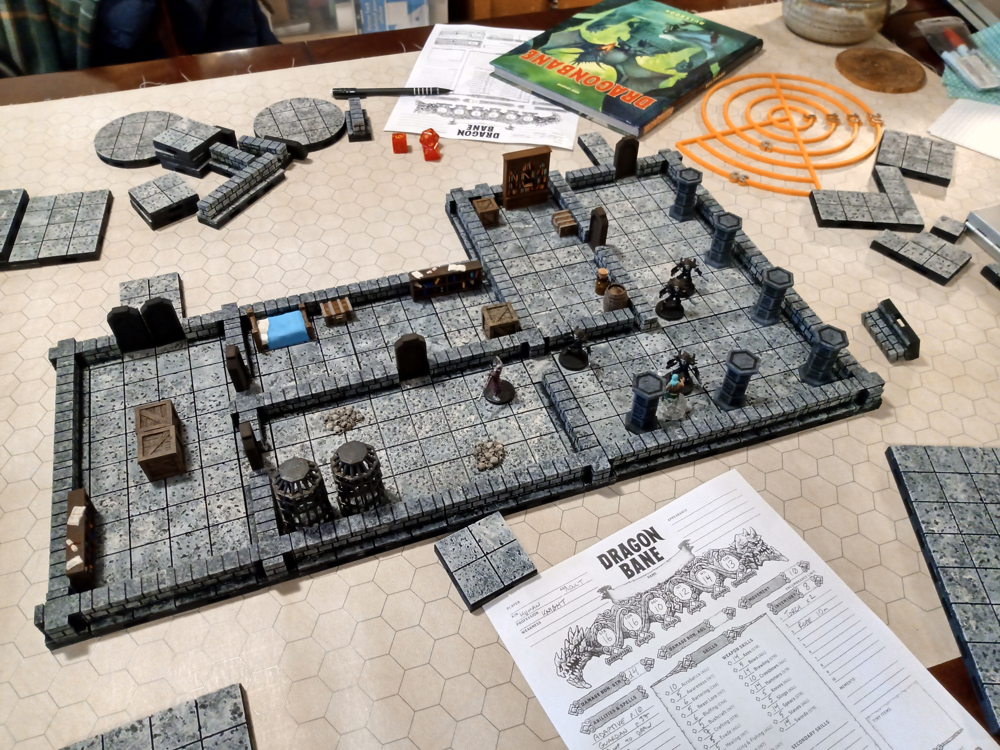

#### Dungeon sticks

If you are into organic shapes, or dislike the rectilinear grid, dungeon stick are for you! Dungeons sticks can be placed on the table, a printed surface, with or without grid. The pieces are connected together with a hinge like system. Full transparency, there are not _that_ many OpenForge Dungeon stick pieces, but there are a lot of OpenForge compatible, or non-OpenForge dungeon sticks. You can search Thingiverse for EC3D and DungeonSticks. As Dungeon sticks are well suited for organic shapes, using them to recreate the map, which is rectilinear, will do them a disservice. As such, a different example is shown of a cave system which organic shapes.
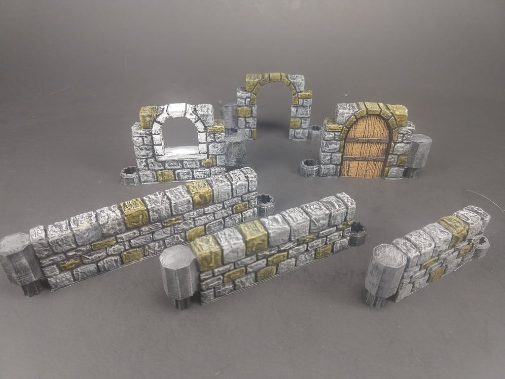
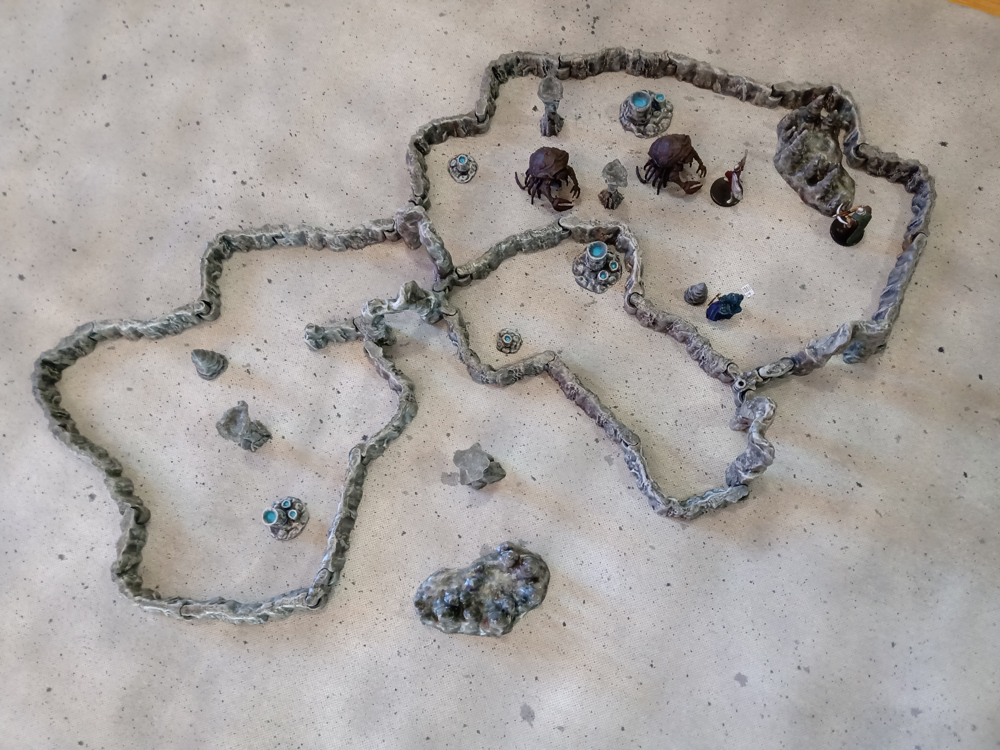

#### What system to use?

We can have a long discussion about this, and perhaps a wiki is not the best place, hard to argue with static text. If you do want to have an interactive discussion on the topic, or have more questions, please join the OpenForge Discord linked below.
To keep it short, use what ever you prefer, or what ever compromise you can live with. Generally it is recommended to use WoT for interior walls, i.e. walls which are in-between rooms, and use SW for external walls, i.e. wall which have nothing at the other side, or hallways as it gives more space for minis in tight corridors.

##### Mixed system example map

Here you will find an example of how to create the example map using mixed systems.

### How to connect tiles together

## Starter sets

### Basic Set

To create a basic set, you will want a selection that lets you build a few small rooms, or a larger, more complex room. To that end, we suggest you start off with the following pieces, printing these will take roughly 1-2 kg of filament and 376 Magnets. You will also need some cyanoacrylate glue (superglue).

#### Floors

* 12 2x2 floors
  * [Base](https://staging.openforge.tools/?tag=size%7Cdepth%7C2&tag=size%7Cwidth%7C2&tag=shape%7Cbase&tag=texture%7Cplain&tag=shape%7Cbase%7Csquare&deny=build%7Cs2w&deny=shape%7Cbase%7Celectronics)
  * [Floor](https://staging.openforge.tools/?tag=connection%7Copenforge&tag=shape%7Cfloor&tag=shape%7Csquare&tag=size%7Cdepth%7C2&tag=size%7Cwidth%7C2) (I suggest filtering by texture for this one, there's a lot here)
* 2 4x4 floors
  * [Base](https://staging.openforge.tools/?tag=shape%7Cbase&tag=texture%7Cplain&tag=shape%7Cbase%7Csquare&tag=size%7Cwidth%7C4&tag=size%7Cdepth%7C4&deny=build%7Cs2w&deny=shape%7Cbase%7Celectronics)
  * [Floor](https://staging.openforge.tools/?tag=connection%7Copenforge&tag=shape%7Cfloor&tag=shape%7Csquare&tag=size%7Cdepth%7C2&tag=size%7Cwidth%7C4) 
* 18 S2W 2x2 Floors (Floors for walls)
  * [Base](https://staging.openforge.tools/?tag=build%7Cs2w&tag=shape%7Cbase&tag=shape%7Cwall&tag=size%7Cdepth%7C2&tag=size%7Cwidth%7C2)
  * [Floor](https://staging.openforge.tools/?tag=build%7Cs2w&tag=shape%7Cwall&tag=size%7Cdepth%7C2&tag=size%7Cwidth%7C2&tag=shape%7Cfloor)
* 2 S2W 4x2 Floors (Floors for walls)
  * [Base](https://staging.openforge.tools/?tag=build%7Cs2w&tag=shape%7Cbase&tag=shape%7Cwall&tag=size%7Cdepth%7C2&tag=size%7Cwidth%7C4)
  * [Floor](https://staging.openforge.tools/?tag=build%7Cs2w&tag=shape%7Cwall&tag=size%7Cdepth%7C2&tag=size%7Cwidth%7C4&tag=shape%7Cfloor)
* 8 S2W 2x2 Corner Floors
  * [Base](https://staging.openforge.tools/?tag=build%7Cs2w&tag=size%7Cdepth%7C2&tag=size%7Cwidth%7C2&tag=shape%7Cbase%7Ccorner)
  * [Floor](https://staging.openforge.tools/?tag=build%7Cs2w&tag=size%7Cdepth%7C2&tag=size%7Cwidth%7C2&tag=shape%7Cfloor&tag=shape%7Cfloor%7Ccorner)
For flexibility, and to maximize the chances of producing usable parts we suggest using s2w versions of tiles wherever possible.

#### Walls

* 14 2x walls
  * [Base](https://staging.openforge.tools/?tag=shape%7Cbase&tag=shape%7Csquare&tag=size%7Cwidth%7C2&tag=build%7Cseparate+wall) (Match the texture of the wall)
  * [Wall](https://staging.openforge.tools/?tag=shape%7Cwall&tag=size%7Cwidth%7C2&tag=build%7Cseparate+wall&tag=component%7Cwall&tag=connection%7Copenforge&tag=shape%7Csquare&deny=connection%7Cpegs)
* 8 2x2 corners
  * [Base](https://staging.openforge.tools/?tag=size%7Cwidth%7C1.5&tag=shape%7Cbase&tag=shape%7Csquare) (Match the texture of the wall)
  * 2x [Left](https://staging.openforge.tools/?tag=size%7Cwidth%7C1.5&tag=connection%7Copenforge&tag=shape%7Csquare&tag=component%7Cwall)
  * [Column](https://staging.openforge.tools/?tag=size%7Ccolumn_shape%7CL&deny=build%7Cs2w&deny=shape%7Ccolumn%7Clow&deny=shape%7Ccolumn%7Ctall&deny=texture%7Cironbound_wood)
* 4 2x doors
  * [Base](https://staging.openforge.tools/?tag=shape%7Cbase&tag=shape%7Csquare&tag=size%7Cwidth%7C2&tag=build%7Cseparate+wall) (Match the texture of the wall)
  * [Wall](https://staging.openforge.tools/?tag=shape%7Cwall&tag=size%7Cwidth%7C2&tag=build%7Cseparate+wall&tag=connection%7Copenforge&tag=shape%7Csquare&tag=component%7Cdoor&deny=connection%7Cpegs)
* 2 4x wide doors
  * [Base](https://staging.openforge.tools/?tag=shape%7Cbase&tag=shape%7Csquare&tag=build%7Cseparate+wall&tag=size%7Cwidth%7C4) (Match the texture of the wall)
  * [Wall](https://staging.openforge.tools/?tag=shape%7Cwall&tag=build%7Cseparate+wall&tag=connection%7Copenforge&tag=shape%7Csquare&tag=component%7Cdoor&tag=size%7Cwidth%7C4&deny=connection%7Cpegs)
* 2 2x windows
  * [Base](https://staging.openforge.tools/?tag=shape%7Cbase&tag=shape%7Csquare&tag=size%7Cwidth%7C2&tag=build%7Cseparate+wall) (Match the texture of the wall)
  * [Wall](https://staging.openforge.tools/?tag=shape%7Cwall&tag=size%7Cwidth%7C2&tag=build%7Cseparate+wall&tag=connection%7Copenforge&tag=shape%7Csquare&tag=component%7Cwindow&deny=connection%7Cpegs)

#### Navigation

[index](index)

## Useful links

* [OpenForge discord server](https://discord.gg/CkEZXSTG2J)
* [OpenForge Reddit](https://discord.gg/CkEZXSTG2J)
* [OpenForge GitHub Tutorials](https://discord.gg/CkEZXSTG2J)
* [OpenForge 2.0 (Masterwork Tools) Patreon](https://www.patreon.com/masterworktools)
* [OpenForge Licensing Info](https://github.com/devonjones/openforge-tutorials/blob/master/How%20Do%20OpenForge%20Licenses%20Work.pdf)
* [OpenForge Tile Tree](https://drive.google.com/file/d/1Amory3eH7ubFf551PzVXWbQ_nFeCyyr5/view)

## Special Thanks

* [Terrain tinker](https://www.terraintinker.com/) for allowing us to use their tool to build visualization and floor layouts

## Good to knows

### Inch vs 25mm?

In the past, OpenForge tiles where scaled such that they were compatible with a 25mm grid. However, newer tiles, and previously released tiles from still supported sets have been updated to be compatible with a 1 inch grid. When you go through older sets, community remixes, or sets from different designers, it is good to keep an eye on this discrepancy in size as 25mm and 1 inch tiles wont play nicely together. If you do come across 25mm tiles, and no 1 inch version is available, you can rescale the tiles yourself in either modeling software or your slicer of choice by a factor of 101.6%.

## notes for future sections, not part of the wiki atm

## different types of wall systems

<https://discord.com/channels/806251193473957958/806260649038577705/1297442612571144237>
There are four (maybe more) ways to do walls with OpenForge. The first is the wall on tile (WoT), where the walls are placed on the tiles meaning you sacrifice internal room space to combat “bloat”. The second one is separate wall (SW) where you please the walls on the outside of the tiles, meaning you get the full floor space but the dungeon will be a little bloated and can cause alignment issues as these separate walls are 0.5 inch wide where a normal tile is 1 inch. The  you have the S system, there the walls are located centered in a 1 inch wide tile. Meaning you get full floor space, no alignment issues, but significantly more bloat, lastly you have dungeon sticks, where the floors don’t exist and the walls are connected by hinge pieces perfect for organic non-rectilinear play like in caves.

Each wall system has advantages and disadvantages.
And of course you can combine separate wall, wall on tile, a system with ease. Not limited to one system per dungeon. You can even combine it with dungeon sticks but don’t know if there are “conversion connections”

## Community creations

Curtesy of DungeonMaestro on the OpenForge discord
[//]: # (  )
Curtesy of luma on the OpenForge discord
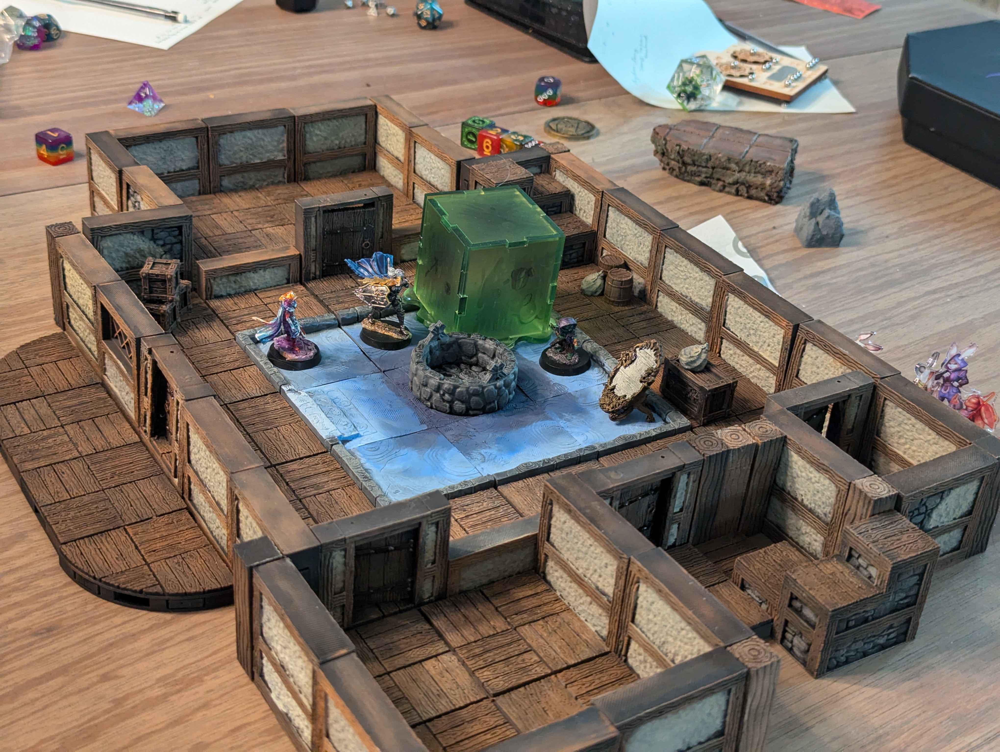
Curtesy of Rtarara on the OpenForge discord
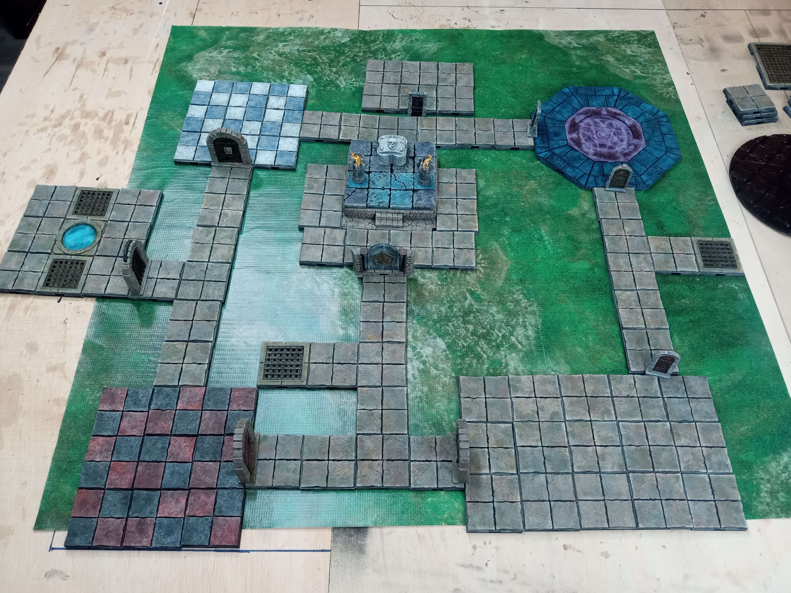
Curtesy of Clown on the OpenForge discord
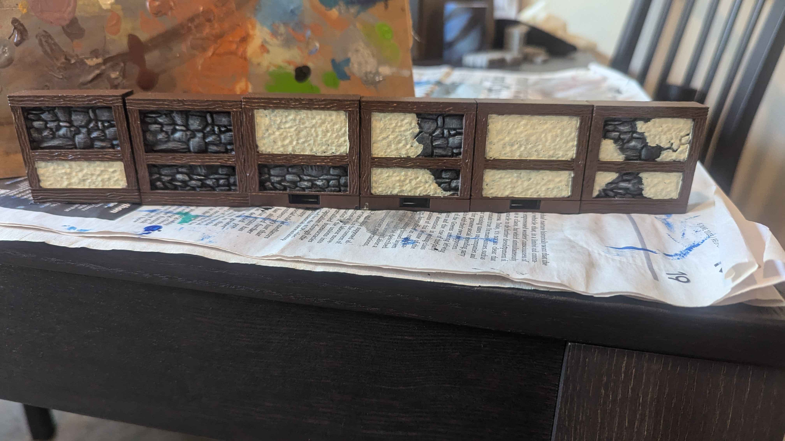
Curtesy of towja on the OpenForge discord
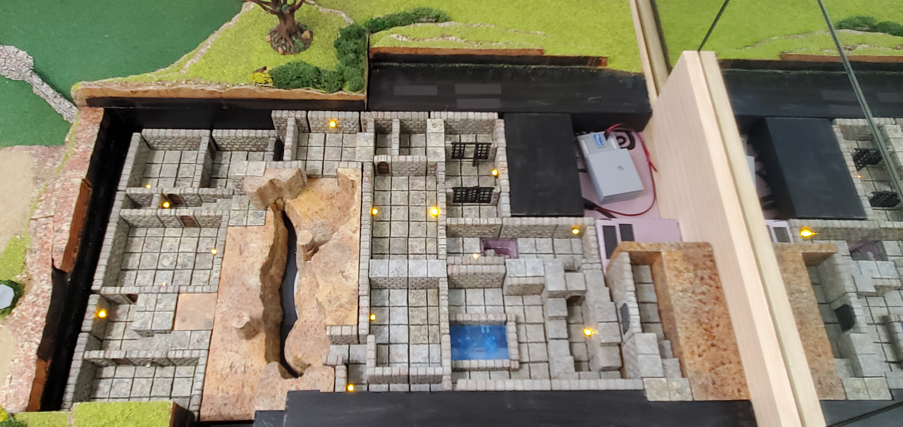
Curtesy of Schadow on the OpenForge discord
